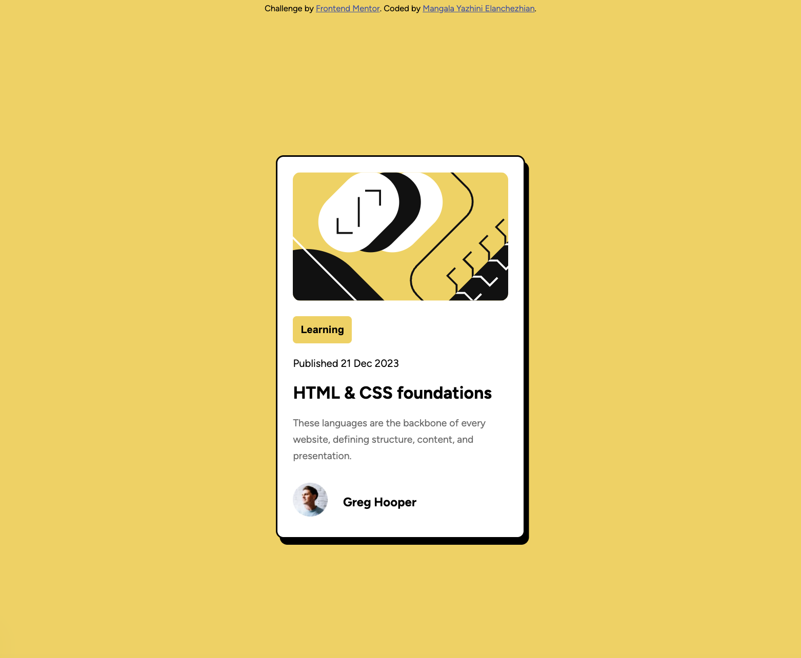

# Frontend Mentor - Blog preview card solution

This is my solution to the [Blog preview card challenge on Frontend Mentor](https://www.frontendmentor.io/challenges/blog-preview-card-ckPaj01IcS).  
Frontend Mentor challenges help improve front-end skills by building realistic projects.

---

## Overview

### The challenge

Users should be able to:

- View the blog preview card layout on different screen sizes
- See hover states for interactive elements

---

### Screenshot

---

### Links

- **Solution URL:** https://github.com/MangalaYazhini/Front-End-Projects/tree/main/blog-preview-card-main  
- **Live Site URL:** https://effortless-puppy-e1d3e1.netlify.app

---

## My process

### Built with

- HTML5
- CSS3
- Flexbox
- Mobile-first workflow

---

### What I learned

- Structuring components using semantic HTML
- Using `flexbox` for layout alignment
- Applying responsive font sizes with `clamp()`
- Improving spacing and typography consistency

---

### Continued development

In future projects, I want to:

- Improve hover and focus interactions
- Practice cleaner CSS structuring
- Explore CSS animations and transitions

---

## Author

- **Name:** Mangala Yazhini Elanchezhian  
- **Frontend Mentor:** https://www.frontendmentor.io/profile/MangalaYazhini  
- **GitHub:** https://github.com/MangalaYazhini  

---

## Acknowledgments

Thanks to Frontend Mentor for providing well-structured challenges that help reinforce core front-end concepts.
