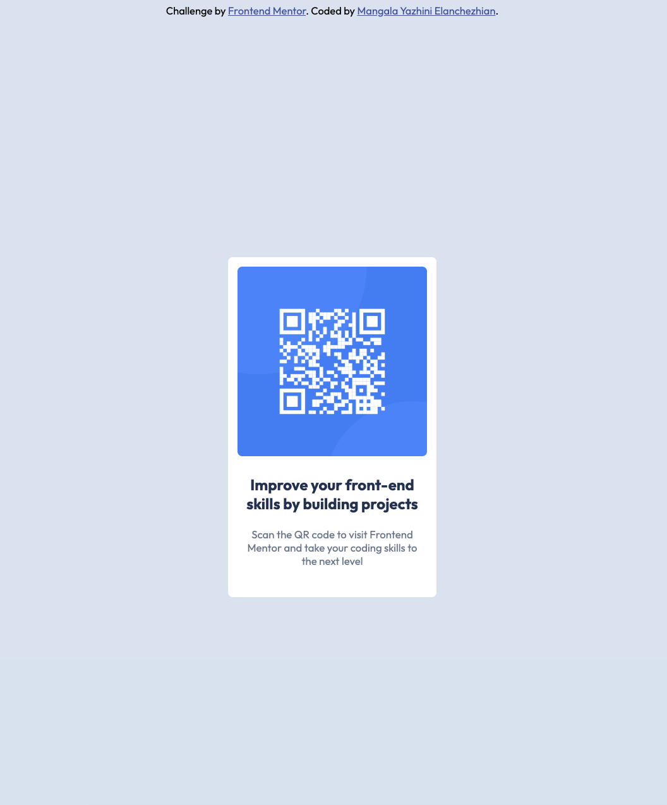

# Frontend Mentor - QR Code Component Solution

This is a solution to the
[QR code component challenge on Frontend Mentor](https://www.frontendmentor.io/challenges/qr-code-component-iux_sIO_H).
Frontend Mentor challenges help improve front-end skills by building realistic projects.

---

## Overview

This project displays a QR code card on the page.  
It is built using HTML and CSS and follows a simple layout.

### Screenshot



---

### Links

- Solution URL: https://github.com/MangalaYazhini/Front-End-Projects/tree/main/qr-code-component-main

---

## My process

### Built with

- HTML5
- CSS3
- Flexbox
- Google Fonts (Outfit)
- Mobile-first workflow

---

### What I learned

While building this project, I learned:

- How to center elements using Flexbox
- How `nth-child()` works in CSS
- The difference between `min-width` / `min-height` 
- How to apply Google Fonts correctly
- How to structure a Frontend Mentor project

Example CSS I used:

```css
html, body {
  min-width: 236px;
  min-height: 460px;
}
