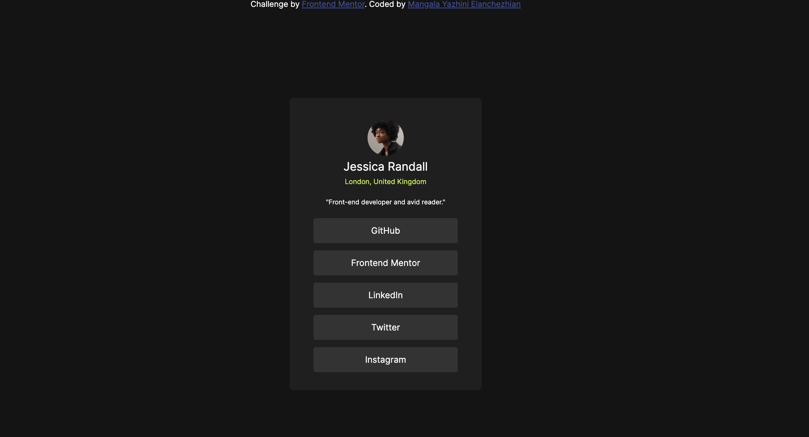

# Frontend Mentor – Social Links Profile

This is my solution to the **Social Links Profile** challenge on Frontend Mentor.  
The goal of this project was to build a responsive profile card using HTML and CSS that closely matches the provided design.

---

## 📸 Screenshot



---

## 🔗 Links

- **Solution URL:** https://www.frontendmentor.io/solutions/social-links-profile-html-css
- **Live Site URL:** https://your-live-site-url.netlify.app

---

## 🚀 My Process

### Built With

- Semantic HTML5
- CSS custom properties
- Flexbox
- Mobile-first workflow
- Local font files (Inter)

---

### What I Learned

While working on this project, I improved my understanding of:

- Centering elements using Flexbox
- Handling responsive layouts with `min-height` and `clamp()`
- Managing overflow and viewport height issues
- Structuring reusable CSS classes

Example CSS I’m proud of:

```css
.profile_div {
  display: flex;
  flex-direction: column;
  align-items: center;
  background-color: hsl(0, 0%, 12%);
  border-radius: 5px;
}
